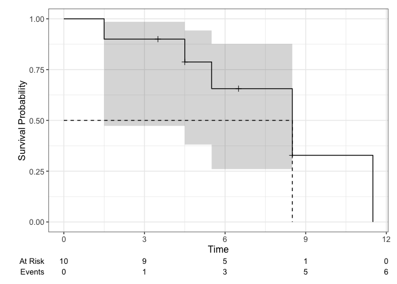

Regression HW2
================
Wen Dai
2024-02-05

1)  Type the data into R as a data frame.

``` r
data=data.frame(
  time=c(1.5,3.5,4.5,4.5,5.5,6.5,8.5,8.5,8.5,11.5),
  status=c(1,0,1,0,1,0,1,0,1,1))
head(data)
```

    ##   time status
    ## 1  1.5      1
    ## 2  3.5      0
    ## 3  4.5      1
    ## 4  4.5      0
    ## 5  5.5      1
    ## 6  6.5      0

``` r
library(survival)
fit=survfit(Surv(time,status)~1,data=data,conf.type="log-log")

summary(fit)
```

    ## Call: survfit(formula = Surv(time, status) ~ 1, data = data, conf.type = "log-log")
    ## 
    ##  time n.risk n.event survival std.err lower 95% CI upper 95% CI
    ##   1.5     10       1    0.900  0.0949       0.4730        0.985
    ##   4.5      8       1    0.787  0.1340       0.3809        0.943
    ##   5.5      6       1    0.656  0.1638       0.2604        0.876
    ##   8.5      4       2    0.328  0.1834       0.0509        0.659
    ##  11.5      1       1    0.000     NaN           NA           NA

2)Plot the Kaplan-Meier Survival Curve

``` r
library(ggsurvfit)
```

    ## Loading required package: ggplot2

``` r
library(ggplot2)
survfit2(Surv(time,status)~1,data=data,
             conf.type="log-log") |> 
          ggsurvfit()+
          add_risktable()+
          add_confidence_interval()+
          add_quantile()+
          add_censor_mark()
```

<!-- -->

3)  Quartiles and 95%CI

``` r
quantile(fit, probs=c(0.25,0.5,0.75),conf.int = TRUE)
```

    ## $quantile
    ##   25   50   75 
    ##  5.5  8.5 11.5 
    ## 
    ## $lower
    ##  25  50  75 
    ## 1.5 1.5 8.5 
    ## 
    ## $upper
    ##  25  50  75 
    ## 8.5  NA  NA

4)  Calculate the mean survival time

``` r
print(fit,rmean="common")
```

    ## Call: survfit(formula = Surv(time, status) ~ 1, data = data, conf.type = "log-log")
    ## 
    ##       n events rmean* se(rmean) median 0.95LCL 0.95UCL
    ## [1,] 10      6   7.94      1.12    8.5     1.5      NA
    ##     * restricted mean with upper limit =  11.5

Let ˆμ2 be the mean survival time estimate if all the censored
observations were events.

``` r
data=data.frame(
  time=c(1.5,3.5,4.5,4.5,5.5,6.5,8.5,8.5,8.5,11.5),
  status=c(1,1,1,1,1,1,1,1,1,1))

library(survival)
fit2=survfit2(Surv(time,status)~1,data=data,conf.type="log-log")

print(fit2,rmean="common")
```

    ## Call: survfit(formula = Surv(time, status) ~ 1, data = data, conf.type = "log-log")
    ## 
    ##       n events rmean* se(rmean) median 0.95LCL 0.95UCL
    ## [1,] 10     10    6.3     0.892      6     1.5     8.5
    ##     * restricted mean with upper limit =  11.5
